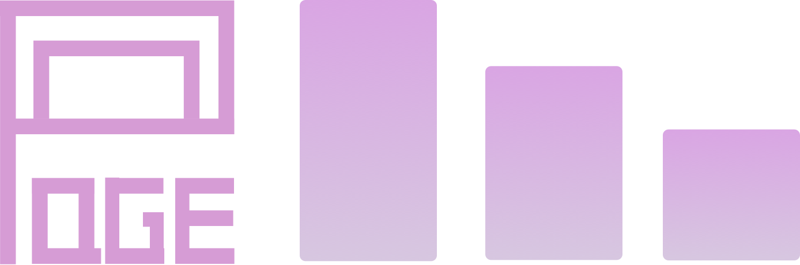

<h3 align="center">
    
</h3>

# ChainPageCollectionView
A custom View with two level chained collection views and fancy transition animation.

## Demo

         

## Requirements

- iOS 9.0+
- Xcode 8

## Installation

### CocoaPods

Update your Podfile to include the following:

```ruby
pod 'ChainPageCollectionView', '~> 1.0'
```
Run `pod install`.

NOTE: If you can not find the pod target. Please follow: https://stackoverflow.com/questions/31065447/no-such-module-when-i-use-cocoapods to build your pod target.

### Carthage

To integrate `ChainPageCollectionView` with `Carthage`, specify it in your `Cartfile`

```
github "jindulys/ChainPageCollectionView" ~> 1.0
```

Then, run the following command to build `ChainPageCollectionView` framework

```
$ carthage update
```
At last, you need to set up your Xcode project manually to add `ChainPageCollectionView` framework.

On your application targets’ `General` settings tab, in the `Linked Frameworks and Libraries` section, drag and drop each framework you want to use from the `Carthage/Build` folder on disk.

On your application targets’ `Build Phases` settings tab, click the `+` icon and choose `New Run Script Phase`. Create a Run Script with the following content:

```
/usr/local/bin/carthage copy-frameworks
```
and add the paths to the frameworks you want to use under `Input Files`:

```
$(SRCROOT)/Carthage/Build/iOS/ChainPageCollectionView.framework
```

Check [Carthage](https://github.com/Carthage/Carthage) if you need more help.

## Usage

### Basic Usage

```swift
import ChainPageCollectionView
```

1. Create ChainPageCollectionView
```swift
// chainView is this view controller's property.
chainView = ChainPageCollectionView(viewType: .normal)
chainView.delegate = self
```
2. Register cell for `parentCollectionView` and `childCollectionView`
```swift
chainView.parentCollectionView.register(#cellType, forCellWithReuseIdentifier:#cellIdentifier)
chainView.childCollectionView.register(#cellType, forCellWithReuseIdentifier:#cellIdentifier)
```

3. Implement `ChainPageCollectionViewProtocol`
```swift
func parentCollectionView(_ collectionView: UICollectionView, numberOfItemsInSection section: Int) -> Int {
  // return your parent data source count.
}

func parenCollectionView(_ collectionView: UICollectionView, cellForItemAt indexPath: IndexPath) -> UICollectionViewCell {
  // Dequeue and configure your parent collectionview cell
}

func childCollectionView(_ collectionView: UICollectionView, numberOfItemsInSection section: Int) -> Int {
  // return your child data source count.
}

func childCollectionView(_ collectionView: UICollectionView, cellForItemAt indexPath: IndexPath) -> UICollectionViewCell {
  // Dequeue and configure your child collectionview cell
}
```

4. Update child collection view data source when parent index has changed.
```swift
// You will get notified by following protocol method.
func childCollectionView(_ collectionView: UICollectionView, parentCollectionViewIndex: Int) {
  // When parent collection view's scroll stops, this will get called with new parent collectionview's index.
  // You can use this message to fetch related child collection view's new data.
  
  // Once you have the latest child collection view's data, set `childCollectionViewDataReady` to `true`.
  // NOTE: This is important to be set, otherwise your child collection view propably will not show up again.
  chainView.childCollectionViewDataReady = true
}
```

### Customization

#### Child Collection View Animation Type

For now `ChainPageCollectionView` support two types of child collection view transition animation.

```swift
public enum ChainPageChildAnimationType {
  case slideOutSlideIn
  case shrinkOutExpandIn
}
```

Default is `slideOutSlideIn`, you can set it via initialization stage.
```swift
let chainView = ChainPageCollectionView(viewType: .normal, 
                                        childAnimationType: #yourchoice)
```

#### Layout

You can customize the layout objects by passing them via `ChainPageCollectionView`'s designated initializer.
```swift
let chainView = ChainPageCollectionView(viewType: .normal, 
                                        parentColectionViewLayout: #yourlayout, 
                                        childCollectionViewLayout: #yourlayout)
```
#### ItemSize

You can use `parentCollectionViewItemSize` and `childCollectionViewItemSize` to set related layouts' itemSize.

#### Screen Ratio

The default behaviour of this view is that parent collection view takes `3/4` height of this view and child collection view takes the rest. You can set `viewType` to a customized ratio with type `customParentHeight(#SomeInt, #SomeInt)`
```swift
let chainView = ChainPageCollectionView(viewType: .customParentHeight(28, 12))
```

## Author
Yansong Li ( liyansong.edw@gmail.com ), wechat: `jindulys_uw`

## License

Expanding collection is released under the MIT license.
See [LICENSE](./LICENSE) for details.


